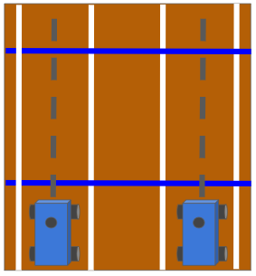
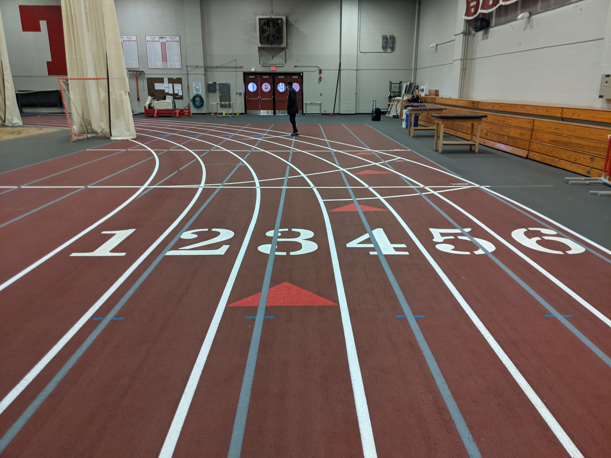
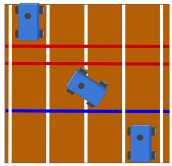
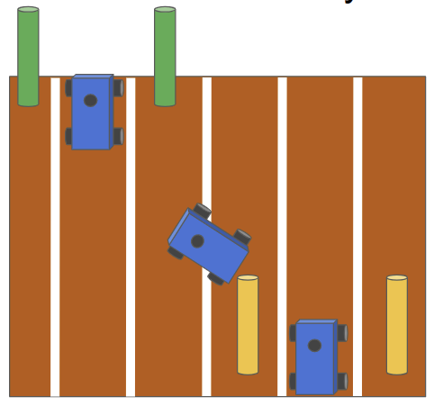
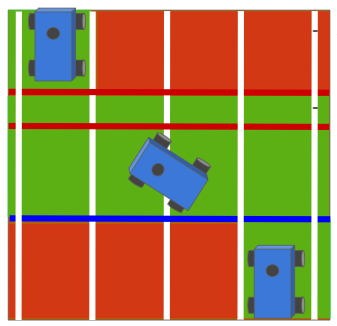
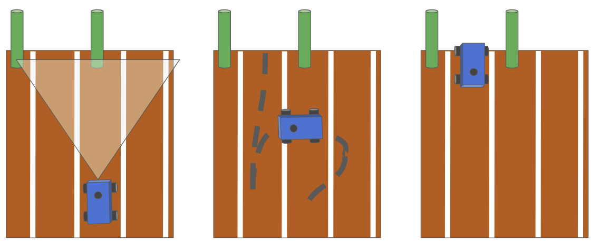

| Deliverable | Due Date              |
|---------------|----------------------------------------------------------------------------|
| Informal Design Review  | Wednesday, May 5th at 8:30AM EDT |
| Race Day | Friday, May 14th at 11:30AM EDT |
| Code Pushed to Github  | Friday, May 14th at 11:59PM EDT |
| Briefing (15 min presentation + 5 min Q&A) and Report ([github pages](https://github.mit.edu/rss/website2021)) | Wednesday, May 19th at 1:00PM EDT |
| [Team Member Assessment](https://forms.gle/Yp4d7eEJxk9rZpWd9)  | Wednesday, May 19th at 1:00PM EDT |

The Final Challenge will be supported by six in-person lab sessions:

| Lab Session   | Date  | Remote Prep | Goals |
|-------------------------|------------------------------------|------------------------------------|------------------------------------|
| FC.1  | Wednesday, April 28th, 8:30-11:00 AM EDT  | Read over the lab handout.  | Introduce the final challenge.   |
| FC.2  | Monday, May 3rd, 8:30-11:00 AM EDT  | Lay out an initial plan for your system. | Informally present your system design to TAs for feedback. (No need to prepare slides unless you want to.) |
| FC.3  | Wednesday, May 5th, 8:30-11:00 AM EDT  | Implement basic solution / components of your system. | Team time  |
| FC.4  | Monday, May 10th, 8:30-11:00 AM EDT  | Complete at least preliminary version of all components. | Team time  |
| FC.5  | Wednesday, May 12th, 8:30-11:00 AM EDT  | Finalize all components and test. | Team time |
| FC.6  | Friday, May 14th, 11:30 AM - 1:30 PM EDT  | Arrive READY TO RACE! | Show off the culmination of all of the cool things you've learned in RSS this semester. |

# Final Challenge 2021 (In-Person)

## Introduction

Congratulations on completing the six labs of RSS! 

This semester, you've learned how to implement real-time robotics software on a widely-used software framework (ROS). You know how to read sensor data (LIDAR, Camera, Odometry) and convert it into a useful representation of the world (homography, localization). You've written algorithms which make plans over the world's state (parking, line following, path planning) and couple with controllers (PD control, pure pursuit) to accomplish tasks. 

Now, your team will synthesize all that you've learned to design a competitive entry for the *2021 RSS Final Challenge*! 

## Grading

| Deliverable  Grade | Weighting             |
|---------------|----------------------------------------------------------------------------|
| Part A: Final Race (out of 100)  | 25% |
| Part B: Dynamic Maneuver Challenge  | 25% |
| Part C: Backwards Navigation Challenge  | 10% |
| Briefing Grade (out of 10) | 10% |
| Report Grade (out of 10) | 30% |

### Part A: Final Race
Part A is worth 25% of your Final Challenge technical grade. Your grade will be calculated based on the time your car takes to drive around the track (`best_race_split`, in seconds) as follows:

  `Part A grade = min(100 + (50 - best_race_split), 110)  - penalties`

Where `penalties` is calculated as follows:

  `penalties = 15 * num_collisions + 5 * num_lane_line_breaches + 5 * num_long_breaches`
  
And `num_lane_line_breaches` is the number of times the car drives outside of either lane line, and `num_long_breaches` is the number of times the car has driven outside of its lane and stayed outside of the lane for greater than 3 seconds.

As you can see from this grading scheme, it is possible to receive bonus points for a very fast and precise solution. The **maximum speed of your car should be capped at 4 m/s**; you should be able to get full points with a good controller. You should, above all, prioritize avoiding collisions, and if your car leaves its lane, it should quickly recover. More information about race day can be found below in this handout.

### Part B: Dynamic Maneuver Challenge

Part B is worth 25% of your Final Challenge technical grade. Your grade will be calculated based on the time your car takes to drive through the maneuver course (`best_maneuver_time`, in seconds) and the number of `penalties` you incur as follows:

`Part B grade = min(100 + (20 - best_maneuver_time), 110) - penalties`

Where `penalties` is calculated as follows:

`penalties = 5 * num_cone_collisions + 10 * num_out_of_bounds`

And `num_cone_collisions` is the number of times the car collides with the cones marking where to drive, and `num_out_of_bounds` is the number of times the car passes of a set of cones without driving between them.

As with Part A, it is possible to receive bonus points for a fast implementation, yet it is important to prioritize the accuracy of the maneuvers. As with Part A, the **maximum speed of your car should be 4 m/s**. However, operating at maximum speed for your entire run will be very challenging for this task. You should start slow and conduct tests to select an appropriate target speed for your car. To receive full credit over this 40-meter course, you will need to cover an average of 2 m/s. 

### Part C: Backwards Navigation Challenge

Part C is worth 10% of your Final Challenge technical grade. Your grade will be calculated based on the number of `penalties` you incur as follows:

`Part C grade = 100 - penalties`

Where `penalties` is calculated as follows:

`penalties = 5 * num_cone_collisions + 10 * num_out_of_bounds`

And `num_cone_collisions` is the number of times the car collides with the cones marking where to drive, and `num_out_of_bounds` is the number of times the car passes of a set of cones without driving between them.

There is no speed incentive for Part C; just bragging rights!

### Briefing Evaluation (see [technical briefing rubric](https://docs.google.com/document/d/1NmqQP7n1omI9bIshF1Y-MP70gfDkgEeoMjpWv8hjfsY/edit?usp=sharing) for grading details)
When grading the Technical approach and Experimental evaluation portions of your briefing, we will be looking specifically for **illustrative videos of your car following the lane and executing lane switch maneuvers.** Specifically, we would like videos highlighting:
- Visualization of lane / marker tracking and stable drive control within a lane
- Execution of the various lane switch behaviors
- Recovery of your car if it is outside of its assigned lane / lane switching was not executed correctly

### Report Evaluation (see [technical report rubric](https://docs.google.com/document/d/1B6l7vKJFN3CPPcMn8cKKArHUU_Bq_YUZ5KxKoP6qMk0/edit?usp=sharing) for grading details)
When grading the Technical approach and Experimental evaluation portions of your report, we will be looking specifically for the following items:

- **Numerical evidence that your algorithms work in the form of charts/data**
  - Numerical evaluation of the success of your lane tracking + following
    - Make sure to mention your method for tuning the controller to closely track the lane.
  - Numerical evidence evaluating the success of your dynamic maneuver algorithm
    - Make sure to mention your method for tuning the controller to execute these maneuvers within the given space as well.

## Part A: Final Race

### Environment and Task

The Final Race will take place on the entire Johnson track loop. This is a standard-size 200m track. Cars may be assigned to follow any of the track's six lanes and will be informed of their lane assignment the morning of the race. Lanes are numbered from left to right as shown in the image below.

<!--  -->

Your car's task is to complete the 200-meter loop around the track as fast as possible, while staying in your assigned lane. Any kind of collision (with another car or with something in Johnson) will be penalized heavily. You should have some kind of safety controller running on your car, but be careful that this doesn't stop your car if there is another car driving next to it on the track! 

### Race Day
On race day, multiple teams (hopefully all five, barring safety concerns) will set up on the track at the same time. A TA will give the start signal, at which point the race begins! You must have a member of your team closely follow your car along the track with the controller ready to take manual control at any moment (yes, a great opportunity to exercise). Your car's split will be recorded at the finish line, and TAs will also be stationed at various points along the track recording lane breaches, if they occur (but hopefully no collisions). Each team will have the opportunity to race **three** times, and we will take the best score.

### Tips

Here are some things you may consider in developing your approach:

- How can you reliably segment the lane lines?
- How can you obtain information about the lane lines in the world frame?
- How can you detect if the car has drifted into a neighboring lane?

## Part B: Dynamic Maneuver Challenge

### Environment and Task

The Dynamic Maneuver challenge will take place on the starting 40-meter straight of the Johnson track.

<!--  -->

<!--  -->

There will be 15-inch cones set up on the straight of the track. Pairs of identically colored cones will be positioned side-by-side with one free lane in between; the possible cone colors are blue, green, and yellow. Your car should drive through each pair of cones--but without moving them!

### Race Day

### Tips

The Dynamic Maneuver Challenge is meant to be open-ended. You should make use of whatever techniques you believe will best solve the problem.

Here are some things you may consider in developing your approach:

- How can the car turn quickly while maintaining knowledge of what lane it's in? Will the cones and lane lines be visible during all parts of your maneuver? Do they need to be?
- Is the Ackermann steering model accurate on the real racecar at high speeds? If not, how can you compensate for or adjust it?

## Part C: Backwards Navigation Challenge

### Environment and Task

The Backwards Navigation challenge will take place on the starting 20-meter straight of the Johnson track.

<!--  -->

<!--  -->

There will be 15-inch cones set up on the straight of the track. Pairs of identically colored cones will be positioned side-by-side with one free lane in between; the possible cone colors are blue, green, and yellow. As in the Dynamic Maneuver Challenge, your car should drive through each pair of cones without moving them. But now, it should only pass through the cones while backing up! You may drive forwards along the rest of the track, however.

### Race Day

### Tips

The Backwards Navigation Challenge is meant to be open-ended. You should make use of whatever techniques you believe will best solve the problem.

Here are some things you may consider in developing your approach:

- How can the car turn quickly while maintaining knowledge of what lane it's in? Will the cones and lane lines be visible during all parts of your maneuver? Do they need to be?

## General Notes

### Structuring your code

The final challenge is the most open-ended assignment in RSS, and comes with minimal starter code. We suggest referring to previous labs for good practices in structuring your solution:
- Start by defining what nodes you will create, what they will subscribe to, and what they will publish. From this plan, write skeleton files, then split up the work of populating them with working code.
- Make useful launchfiles and set launch-time variables via rosparams. Refer to previous labs for syntax.

### Leveraging previous labs

You are encouraged to build your solution on code written in previous labs! If you are using your old homography solution, it's good idea to verify its accuracy. If you've switched to a new car, the homography may be substantially different.

### Increasing the speed limit
In previous labs, the racecar was throttled to a default maximum speed of 2 m/s. You can change the max racecar speed by editing the `speed_min`/`speed_max` in this file: https://github.com/mit-racecar/racecar/blob/master/racecar/config/racecar-v2/vesc.yaml

These speeds are measured in ERPM. The conversion factor is 4614 ERPM per m/s (this is a parameter at the top of the file). The hardware limit is ~20000 ERPM. *This should be the maximum value you set in `vesc.yaml`*.

Note that this does not change the max speed of the joystick. If you want the joystick to command a higher speed change the scale parameter for drive.speed in this file: https://github.com/mit-racecar/racecar/blob/master/racecar/config/racecar-v2/joy_teleop.yaml. The scale parameter multiples the joystick output which is in the range [−1,1] to produce a speed.

## FAQ

### Part A: Final Race

*Do we need to design a safety controller for this challenge?* 
* You should run some kind of safety controller during the challenge, but don't need to spend a lot of time adapting it to the race setting. The easiest way to keep the race collision-free will be for each team to design a robust lane-following solution and remain in-lane. Note: some teams showed solutions in Lab 3 that considered a fixed angle range in front of a car only when deciding when to stop the car. **You should make sure that cars racing alongside yours will not wrongly trigger your safety controller, especially when turning bends in the track!** Consider testing with objects in adjacent lanes.

*Will we be penalized if another car comes into our lane and we crash?*
* No. If you stay in your lane, you will not be considered at fault for any collision. We will give every team the opportunity to record three interference-free lap times on race day.

*Doesn't the car in the outside lane have to travel farther?*
* We will stagger the starting locations so every car travels the same distance. You should be prepared to race in any lane.

### Part B: Dynamic Maneuver Challenge
(Note: a "gate" refers to a pair of cones that the car is expected to pass through.)

*Will the gates always be in the same configuration?*
* The gate positions, gate lanes, and order of gate colors may change on race day. We do guarantee that the two cones in each gate will have the same color, and each gate's cones will be placed in one of the following lane pairs: [(1, 3), (2, 4), (3, 5), (4, 6)]. Also, the (1, 3) and (4, 6) gates won't be in sequence (maximum number of lanes to move between gates is two).

*What is the minimum and maximum distance between gates?*
* The minimum distance will be six meters. There is no maximum distance.

*How many gates will there be on race day?* 
* Four.

### Part C: Backwards Navigation Challenge

*Will the gates always be in the same configuration?*
* Same answer as part B.

*What is the minimum and maximum distance between gates?*
* Same answer as part B.

*How many gates will there be on race day?*
* Two.
